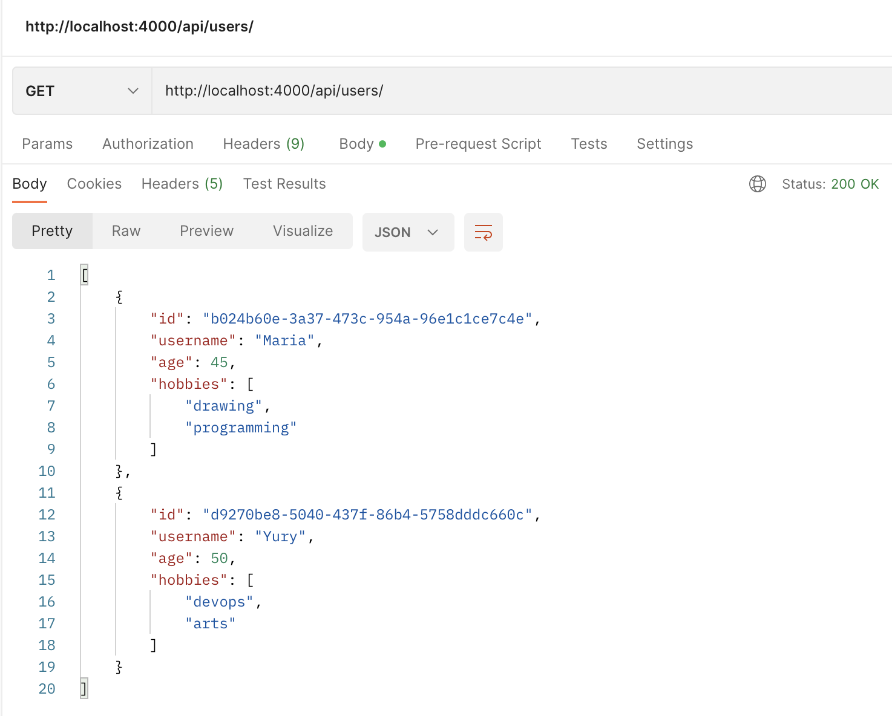
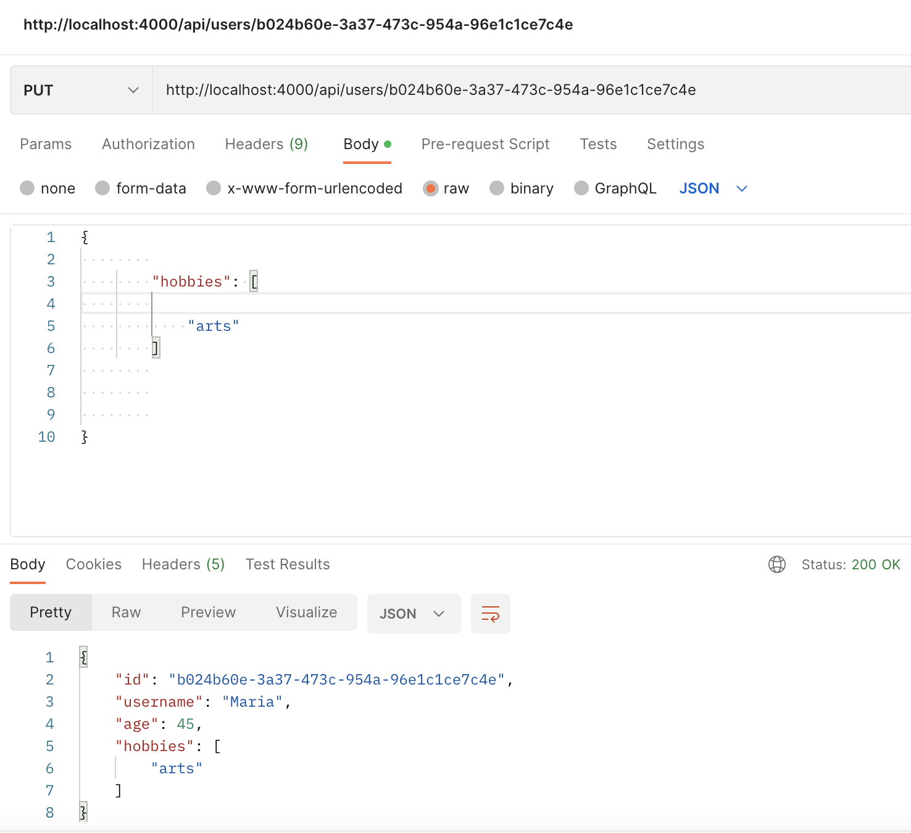
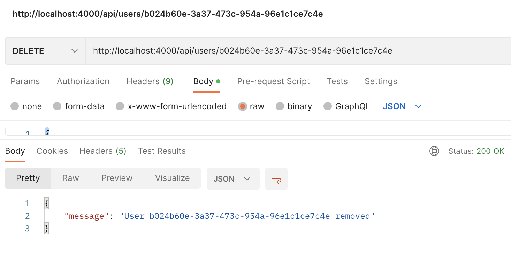
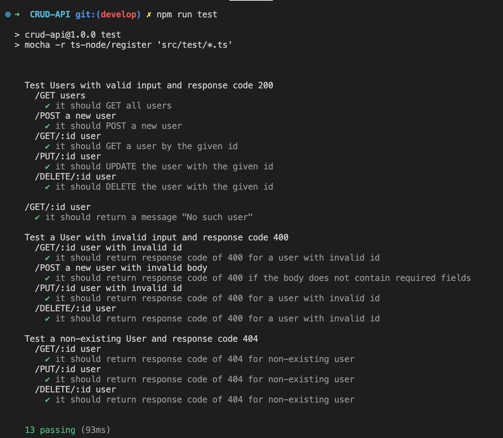
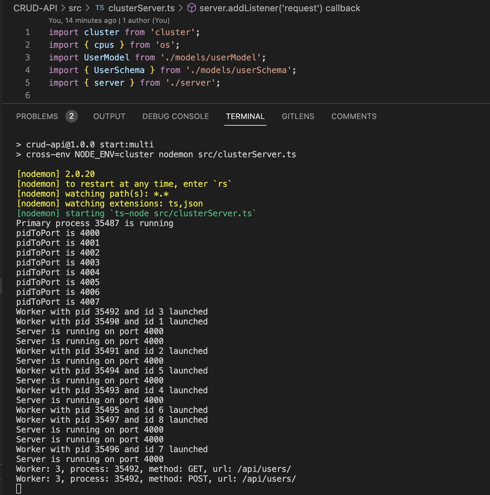

# Nodejs CRUD API

## Description

This is a simple CRUD API implemented with nodejs `http` core module and using in-memory database to manipulate the data while the app is running. This task was implemented as part of the Nodejs course at the Rolling Scopes School.

## Installation and usage instructions

- Clone the repository by `git clone https://github.com/mlatysheva/CRUD-API.git`
- `cd` into the cloned repository
- checkout to `develop` branch by running `git checkout -b develop`
- Use 18 LTS version of Node.js

- To run the app in the development mode, type the following command through the CLI:
```bash
npm run start:dev
```
- To run the app in the production mode, type the following command through the CLI:
```bash
npm run start:prod
```
- To run multiple instances of the app using the nodejs `cluster` module, type the following command through the CLI:
```bash
npm run start:multi
```

## Technical requirements

- The task is implemented with Typescript
- Stack used:
  - nodejs
  - nodemon
  - dotenv, cross-end
  - typescript, ts-node
  - eslint, prettier
  - webpack, webpack-cli, 
  - uuid
  - @types/*
  - mocha, chai, chai-http have been used for tests
- 18 LTS version of Node.js
- Asynchronous API were preferred whenever possible

## Implementation details

1. Implemented endpoint `api/users`:
    - **GET** `api/users` is used to get all users
        - Server answers with `status code` **200** and all users records
    
    - **GET** `api/users/${userId}` 
        - Server answers with `status code` **200** and and a record with `id === userId` if it exists
        - Server answers with `status code` **400** and a corresponding message if `userId` is invalid (not `uuid`)
        - Server answers with `status code` **404** and a corresponding message if the record with `id === userId` doesn't exist
    - **POST** `api/users` is used to create a record about the new user and store it in the database
        - Server answers with `status code` **201** and the newly created record
        - Server answers with `status code` **400** and a corresponding message if the request `body` does not contain **required** fields
    - **PUT** `api/users/{userId}` is used to update an existing user
        - Server answers with` status code` **200** and the updated record
        - Server answers with` status code` **400** and a corresponding message if `userId` is invalid (not `uuid`)
        - Server answers with` status code` **404** and a corresponding message if the record with `id === userId` doesn't exist
    
    - **DELETE** `api/users/${userId}` is used to delete an existing user from the database
        - Server answers with `status code` **204** if the record is found and deleted
        - Server answers with `status code` **400** and a corresponding message if `userId` is invalid (not `uuid`)
        - Server answers with `status code` **404** and a corresponding message if the record with `id === userId` doesn't exist
    
2. Users are stored as `objects` that have the following properties:
    - `id` — unique identifier (`string`, `uuid`) generated on the server side
    - `username` — user's name (`string`, **required**)
    - `age` — user's age (`number`, **required**)
    - `hobbies` — user's hobbies (`array` of `strings` or an empty `array`, **required**)
3. Requests to non-existing endpoints (e.g. `some-non/existing/resource`) are handled (the server answers with `status code` **404** and a corresponding human-friendly message)
4. Errors on the server side that occur during the processing of a request are handled and processed correctly (the server answers with `status code` **500** and a corresponding human-friendly message)
5. Value of `port` on which the application is running is stored in `.env` file
6. There are 2 modes of running the application (**development** and **production**):
    - The application is run in the development mode using `nodemon` (there is a `npm` script `start:dev`)
    - The application is run in the production mode (there is a `npm` script `start:prod` that starts the build process and then runs the bundled file)
7. There are three test scenarios for the API. 
  The first test scenario checks for valid entries:
    1. Get all records with a `GET` `api/users` request (an empty array is expected)
    2. A new object is created by a `POST` `api/users` request (a response containing newly created record is expected)
    3. With a `GET` `api/user/{userId}` request, we get the created record by its `id` (the created record is expected)
    4. We update the created record with a `PUT` `api/users/{userId}`request (a response is expected containing an updated object with the same `id`)
    5. With a `DELETE` `api/users/{userId}` request, we delete the created object by `id` (confirmation of successful deletion is expected)
    6. With a `GET` `api/users/{userId}` request, we are trying to get the deleted object by its `id` (expected answer is that there is no such object)
  The second scenario tests the requests to the server using invalid user id (response code 400).
  The third scenario tests the requests to non-existing urls or non-existing entries (response code 404).


8. A horizontal scaling is implemented for the application (there is a `npm` script `start:multi` that starts multiple instances of the application using the Node.js `Cluster` API (equal to the number of logical processor cores on the host machine, each listening on port PORT + n) with the default **load balancer** that distributes requests across them (using Round-robin algorithm). 
- State of the database is consistent between different workers.


